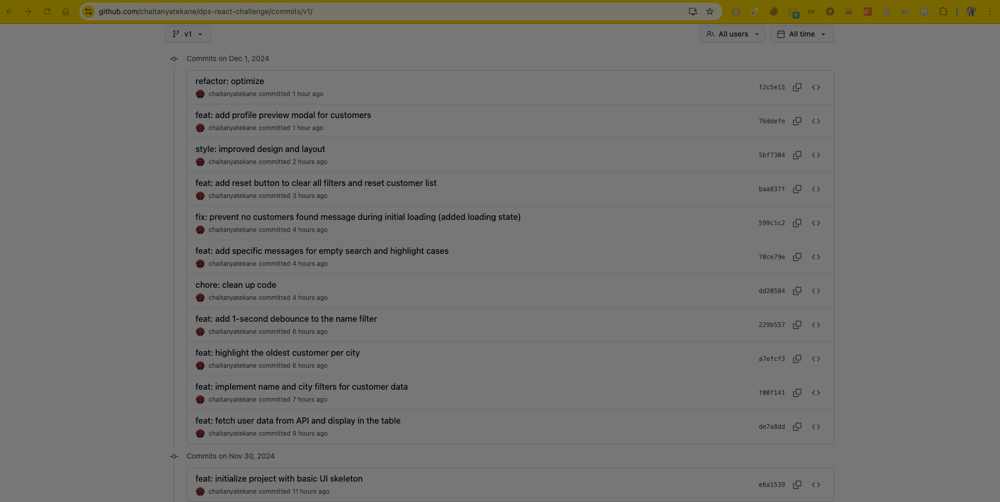

# DPS Frontend Coding Challenge

## Overview

This project implements a React-based web application for managing customer data in a CRM system. It meets the challenge requirements, implements optional optimizations and adds extra features to enhance functionality and user experience. The project was structured with clean commits and branching strategies for clear progress tracking.

## Demo

[Watch the demo video](https://youtu.be/gB_mQvX3mww)

[](https://youtu.be/gB_mQvX3mww)

## Environment Setup

(1). Ensure you have Node.js (v14.x or later) and npm (v6.x or later) installed.

(2). Clone this repository:

```
git clone <your-repo-url>
cd <project-folder>
```

(3). Install dependencies:

```
npm install
```

(4). Start the development server:

```
npm run dev
```

(5). Open the application in your browser at http://localhost:3000.

## Branching Strategy

-   `master`: The main branch containing the final merged code.
-   `v1`: A feature branch where all challenge tasks and additional features were implemented in small, incremental commits. After completing all tasks, the v1 branch was merged into master.

## Features Implemented

### Mandatory Features

-   **UI Implementation**: Built a clean, responsive UI based on the mockup provided in the challenge. Included a table to display customer data with filters.

-   **Data Integration**: Connected to the API endpoint https://dummyjson.com/users to fetch and display customer data dynamically.

-   **Client-side Filtering**:

    -   Name Filter: A search input field to filter customers by firstName or lastName.
    -   City Filter: A dropdown to filter customers by their city.

-   **Highlight Oldest Users**: Implemented a checkbox that highlights the oldest user in each city.

### Optional Features

-   **Debounce on Name Filter**: Added a 1-second debounce to prevent frequent filtering and improve performance.

### Extra Features

-   **Error Messages**: Displayed user-friendly messages when no customers match the applied filters.

-   **Loading State**: Displayed a `"Loading customers..."` message while fetching data from the API.

-   **Profile Modal**: Added a `"View Profile"` button to each customer row, opening a modal with detailed customer information (e.g., `email`, `phone`, `address` and `company`). Modal closes when clicking outside or on the close button.

-   **Reset Enhancements**: Reset button clears all filters, resets the dropdown to `"Select City"`, resets the `Name Filter input` and also resets the `highlight oldest per city`

-   **Improved Styling**: Enhanced the visual appeal of the web app with better colors, hover effects and box shadows. Ensured consistent spacing and alignment.

## Commit History

Commit Logs (from v1 Branch)



## Submission

The project includes:

-   Required features (UI implementation, filtering, highlighting).

-   Optional debounce feature.

-   Extra features such as error messages, loading state, a profile modal, reset option, enhanced styling and responsiveness.

The complete code and history are available in the repository, including the `master` and `v1` branches.

Excited to work with Digital Product School! 😊
